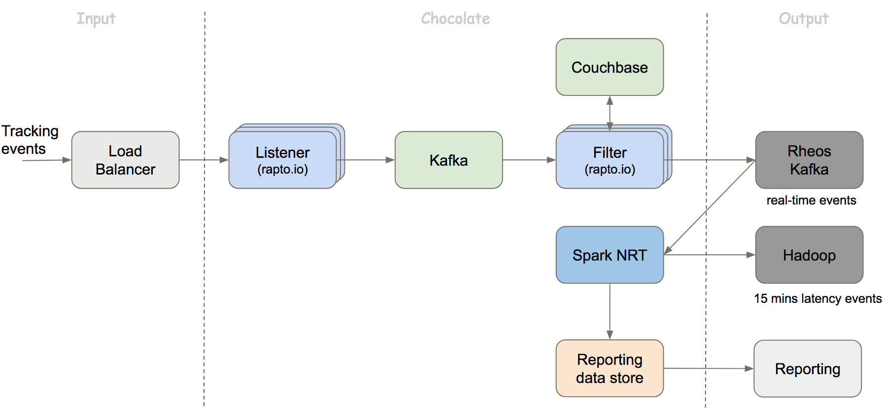

# Chocolate
## Overview

## Design

### Data Latency
The system has two outputs, one is real-time events in Rheos Kafka, another is 15 minutes latency batch events on Apollo Hadoop.

### Data Quality
* **Zero data loss**
* **Zero duplication**
The above two are our goals. The system leverages Kafka's at-least-once feature to guarantee zero data loss, each component in the system will update the consumer's offset only if it has delivered the event messages to next persistence storage. The spark NRT job will do de-dupe for the events before persistence on Hadoop. 
Currently we use Rheos Kafka to store the final real-time events, it uses 0.10.0.x version of Kafka which doesn't support exactly-once, so "Zero duplication" is only for batch events on Apollo Hadoop. One thing needs to mention, currently the rapto.io instances may be unstable occasionally, or due to redeploy listener services, few events in buffer of the Kafka producer will lose, the percentage is quite small, < 0.5%, We will enhance this in future version.

### System Availability, Scalability
* **Cross Data-center**
 For the raptor.io services, we deploy them in multiple DCs, and for the Bigdata infrastructure, like Kafka, Couchbase, we choose the cross DC solution. For Spark NRT jobs, if the Hadoop in one DC fails, we will switch to run the jobs on another DC.

* **No Single Point Failure**

* **Linear Scalable**
 System supports adding more nodes to handle larger traffic.

## Components
### Listener
Listener is to handle requests of tracking events from external sites, and send the events to Kafka.

### Filter
Filter is to run real-time filter rules on the tracking events. For capping rules which needs to take longer time to run, they are handled in Spark NRT. See [RT rules](filter/README.md) and [Capping rules](spark-nrt/README.md).

### Spark NRT
* De-dupe and dump tracking events to Hadoop.
* Run capping rules.
* Generate reporting data.

## Output Schema
See [Table Schema on Hadoop](common/src/main/avro/versions) and [Event Schema in Rheos](https://rheos-portal.stratus.ebay.com/rheosportal/).

